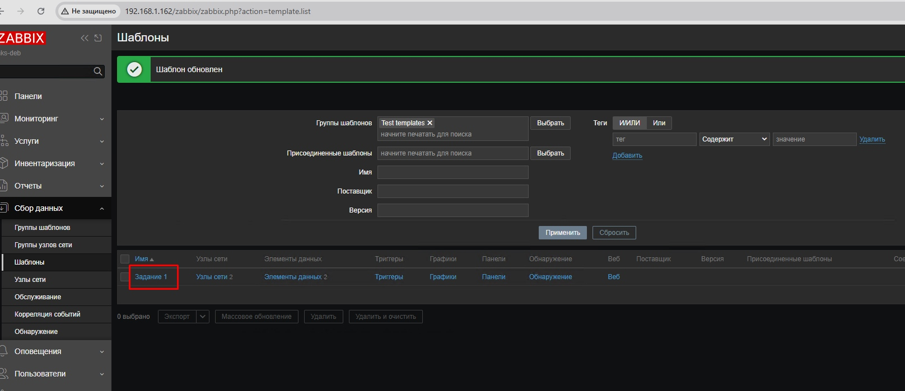
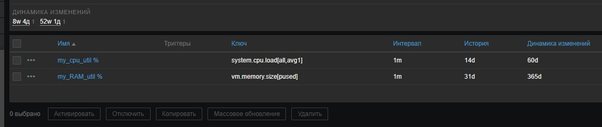
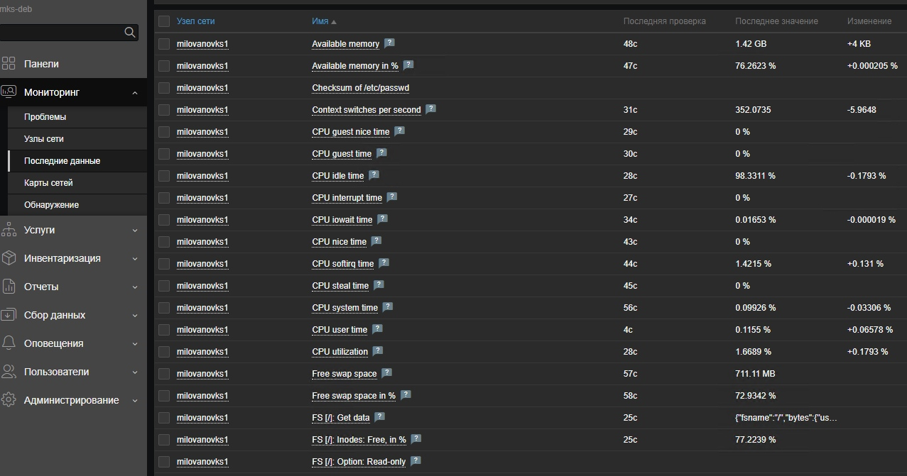
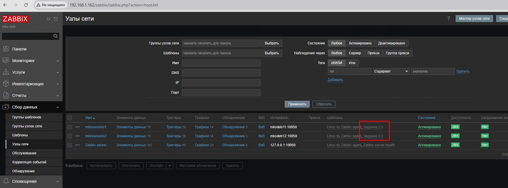
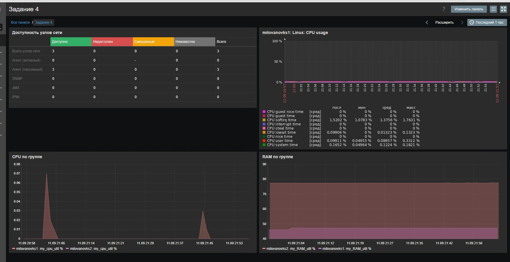

# Домашнее задание к занятию "`Система мониторинга Zabbix. Часть 2`" - `Милованов Константин`

---

### Задание 1

Создайте свой шаблон, в котором будут элементы данных, мониторящие загрузку CPU и RAM хоста.

1. В веб-интерфейсе Zabbix Servera в разделе Templates создайте новый шаблон
2. Создайте Item который будет собирать информацию об загрузке CPU в процентах
3. Создайте Item который будет собирать информацию об загрузке RAM в процентах

Прикрепите в файл README.md скриншот страницы шаблона с названием «Задание 1»

Шаблон, в котором элементы, мониторящие загрузку CPU и RAM хоста:


Элементы данных:


Ключ элемента о загрузке CPU:
```
system.cpu.load[all,avg1]
```

Ключ элемента о загрузке RAM:
```
vm.memory.size[pused]
```

---

### Задание 2

Добавьте в Zabbix два хоста и задайте им имена <фамилия и инициалы-1> и <фамилия и инициалы-2>. Например: ivanovii-1 и ivanovii-2.

1. Установите Zabbix Agent на 2 виртмашины, одной из них может быть ваш Zabbix Server
2. Добавьте Zabbix Server в список разрешенных серверов ваших Zabbix Agentов
3. Добавьте Zabbix Agentов в раздел Configuration > Hosts вашего Zabbix Servera
4. Прикрепите за каждым хостом шаблон Linux by Zabbix Agent
5. Проверьте что в разделе Latest Data начали появляться данные с добавленных агентов

Результат данного задания сдавайте вместе с заданием 3

Скрин с Latest Data:


---

### Задание 3

Привяжите созданный шаблон к двум хостам. Также привяжите к обоим хостам шаблон Linux by Zabbix Agent.

1. Зайдите в настройки каждого хоста и в разделе Templates прикрепите к этому хосту ваш шаблон
2. Так же к каждому хосту привяжите шаблон Linux by Zabbix Agent
3. Проверьте что в раздел Latest Data начали поступать необходимые данные из вашего шаблона

Прикрепите в файл README.md скриншот страницы хостов, где будут видны привязки шаблонов с названиями «Задание 2-3». Хосты должны иметь зелёный статус подключения.

Поскольку в шаблоне `Linux by Zabbix Agent` уже существует ключ, указанный в задании 1, заббикс не дает добавить мой шаблон. Пришлось изменить ключ в моем шаблоне для Item "my_cpu_util %", изменив аргументы:
```
system.cpu.load[percpu,avg1]
```

Скриншот страницы хостов, где видны привязки шаблонов с названиями «Задание 2-3»:



### Задание 4

Создайте свой кастомный дашборд.

1. В разделе Dashboards создайте новый дашборд
2. Разместите на нём несколько графиков на ваше усмотрение.

Скриншот дашборда:

